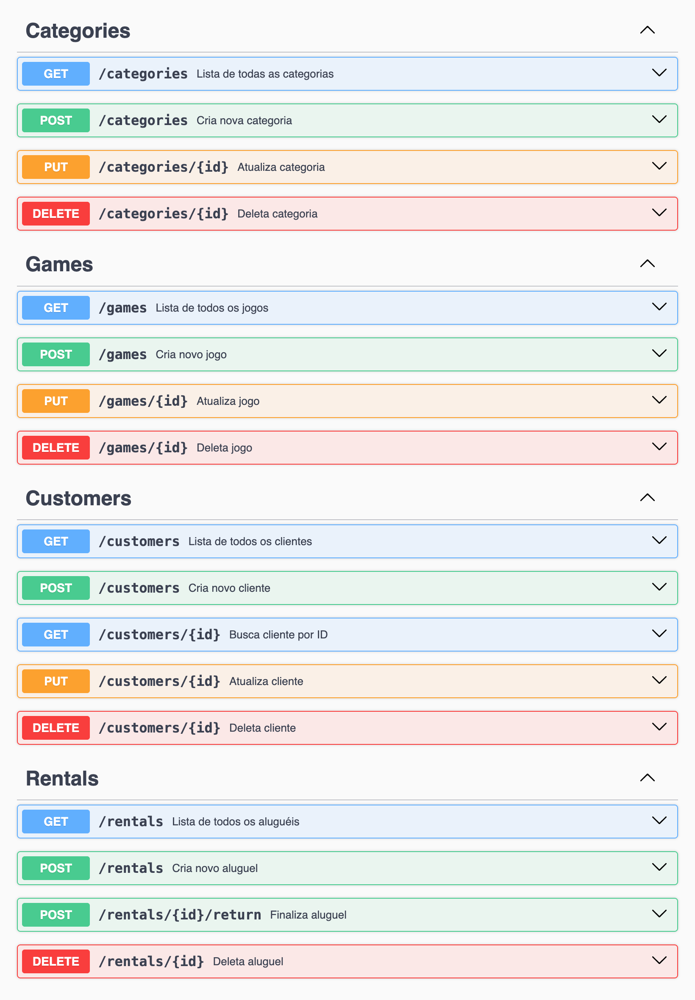

<p align="center"></p>

# <p align="center">BoardCamp</p>

### <p align="center">API de gerenciamento de uma locadora de jogos de tabuleiro</p>

<div align="center">
   
   
   
   
    
    
   
   
    
</div>

## :clipboard: Descrição

O BoardCamp é uma API desenvolvida com Node.js, Express e PostgreSQL que simula a gestão de uma locadora de jogos de tabuleiro. A aplicação permite o controle de categorias, jogos, clientes e aluguéis.

A API cobre funcionalidades CRUD completas, incluindo, verificação de disponibilidade, cálculo de multa por atraso.

<!-- 🎲 [**API Link**](https://link-to-somewhere.com) -->

## :bookmark_tabs: Características do projeto

-   CRUD completo de jogos e categoria
-   CRUD de clientes, com validação de CPF, nome, telefone e data de nascimento
    -   Filtros por parâmetros (cpf)
-   CRUD de aluguéis, com:
    -   Registro de novos aluguéis
    -   Validação de disponibilidade
    -   Finalização de aluguel com cálculo de multa por atraso
    -   Exclusão de aluguéis não finalizados
    -   Filtros por parâmetros (customerId, gameId)

## :rocket: Inicializando este projeto

Primeiro de tudo, clone este projeto ou faça o download do ZIP.

Para realizar o clone, no terminal de sua máquina, utilize o [git](https://git-scm.com/) e insira o seguinte comando:

```bash
   git clone https://github.com/GabrielaTiago/BordCamp.git
```

Entre na pasta do projeto

```bash
    cd BordCamp
```

Crie o arquivo de variáveis de ambiente `.env` na raíz do projeto. Você pode fazer isso manualmente ou utilizando os seguinte comando:

```bash
    cp .env.example .env
```

O arquivo `.env.example` já está configurado com as variáveis necessárias para o funcionamento da aplicação. Você pode editá-lo conforme necessário.

Todos os comandos para gerenciar a aplicação foram simplificados como scripts `npm`.

## 📍 Rodando a Aplicação Localmente

Para executar esse projeto localmente é necessário que você possua o [Node.js](https://nodejs.org/en/download) e [npm](https://www.npmjs.com/) instalados em sua máquina. Você também precisará instalar o [PostgreSQL](https://www.postgresql.org/download/) para configurar o banco de dados.

No `.env` modifique as variáveis de ambiente para corresponder às suas configurações locais do PostgreSQL:

```env
    POSTGRES_USER=seu_usuario       # geralmente é postgres
    POSTGRES_PASSWORD=sua_senha
    POSTGRES_HOST=localhost         # na maioria dos casos, localhost
```

Execute o seguinte comando para instalar as dependências.

```bash
    npm install
```

Para ininicilizar e criar o banco de dados, execute:

```Bash
   cd database-boardcamp
   bash ./create-database
   cd ..
```

Para iniciar o servidor, execute o comando:

```bash
    npm start
```

## 🐳 Rodando a Aplicação com Docker

Para rodar a aplicação utilizando o Docker, você precisa ter o [Docker](https://docs.docker.com/engine/install/) e [Docker Compose](https://docs.docker.com/compose/install/) instalados em sua máquina.

Execute o seguinte comando para construir as imagens e iniciar os containers da API e do banco de dados:

```bash
    npm run docker:dev
```

Para parar os containers, execute:

```bash
    npm run docker:stop
```

Para remover os containers, volumes e imagens criadas, realizando assim o resete completo, execute:

```bash
    npm run docker:destory
```

## :world_map: Rotas

A aplicação estará disponível em: `http://localhost:4000`

Para acessar a documentação, implementada com **swagger**, acesse a rota: [**/documentation**](http://localhost:4000/documentation)



## :test_tube: Testes

Para executar os testes, você pode utilizar o comando:

```bash
    npm test
```

Ou com docker:

```bash
    npm run docker:test
```

Os testes estão localizados na pasta `src/services/tests` e são organizados em arquivos separados para cada funcionalidade da API, como `categories.test.js`, `games.test.js`, `customers.test.js` e `rentals.test.js`.

## :bulb: Reconhecimentos

-   [Badges para Github](https://github.com/alexandresanlim/Badges4-README.md-Profile#-database-)
-   [Inspiração de README](https://gist.github.com/luanalessa/7f98467a5ed62d00dcbde67d4556a1e4#file-readme-md)
-   [Driven Education](https://www.driven.com.br)

## 👩🏽‍💻 Autora

Gabriela Tiago de Araújo

-   email: <gabrielatiagodearaujo@outlook.com>
-   linkedin: <https://www.linkedin.com/in/gabrielatiago/>
-   portfolio: <https://gabrielatiago.vercel.app>

[🔝 Back to top](#boardcamp)
